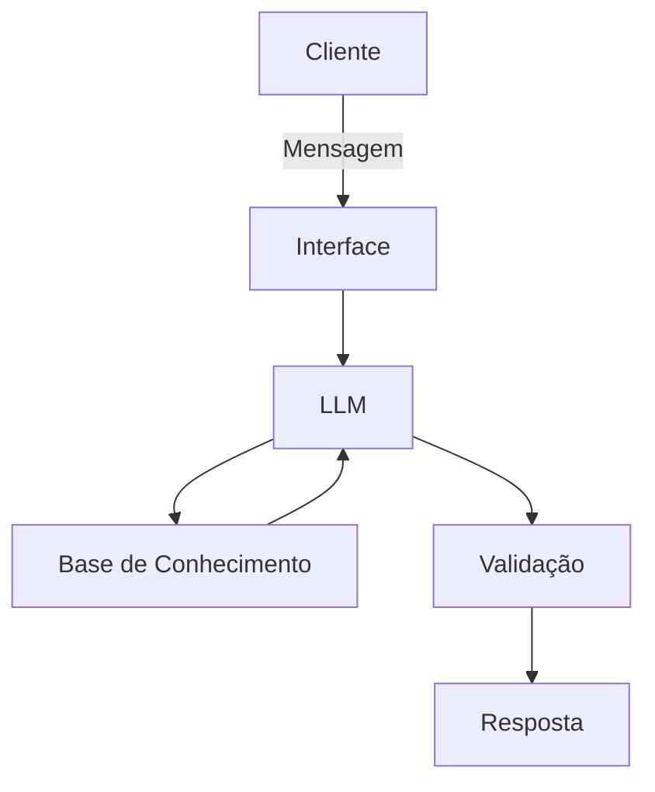

# Documentação do Agente

## Caso de Uso

### Problema
> Qual problema financeiro seu agente resolve?

O agente financeiro proposto busca resolver o problema da baixa visibilidade e da pouca capacidade analítica que muitos usuários têm sobre sua vida financeira. Embora frequentemente registrem receitas e despesas, esses usuários nem sempre conseguem interpretar os dados, comparar valores planejados com os efetivamente realizados, identificar padrões de consumo ou tomar decisões corretivas. O agente atua justamente nesse ponto, transformando dados brutos do orçamento em análises, alertas e recomendações práticas.

### Solução
> Como o agente resolve esse problema de forma proativa?

O agente resolve o problema de forma proativa ao analisar continuamente os dados financeiros do usuário — como receitas, despesas e planejamento — identificando automaticamente desvios, padrões de consumo e riscos no orçamento, sem depender de solicitações explícitas. A partir dessa análise, ele gera alertas, diagnósticos e recomendações práticas, orientando o usuário sobre ajustes necessários, oportunidades de economia e melhoria na gestão financeira, transformando dados brutos em decisões claras e acionáveis.

### Público-Alvo
> Quem vai usar esse agente?

O público-alvo do agente são pessoas físicas que desejam melhorar o controle do seu orçamento pessoal, especialmente aquelas que possuem renda mensal fixa ou previsível, registram receitas e despesas (em planilhas ou aplicativos), mas têm dificuldade em interpretar esses dados e transformá-los em decisões práticas. Inclui iniciantes em educação financeira, usuários que buscam organização, redução de gastos e maior equilíbrio financeiro, bem como aqueles interessados em evoluir para um planejamento mais eficiente e sustentável.

---

## Persona e Tom de Voz

### Nome do Agente
[Nome escolhido]

### Personalidade
> Como o agente se comporta? (ex: consultivo, direto, educativo)

[Sua descrição aqui]

### Tom de Comunicação
> Formal, informal, técnico, acessível?

[Sua descrição aqui]

### Exemplos de Linguagem
- Saudação: [ex: "Olá! Como posso ajudar com suas finanças hoje?"]
- Confirmação: [ex: "Entendi! Deixa eu verificar isso para você."]
- Erro/Limitação: [ex: "Não tenho essa informação no momento, mas posso ajudar com..."]

---

## Arquitetura

### Diagrama

### Componentes

| Componente | Descrição |
|------------|-----------|
| Interface | [ex: Chatbot em Streamlit] |
| LLM | [ex: GPT-4 via API] |
| Base de Conhecimento | [ex: JSON/CSV com dados do cliente] |
| Validação | [ex: Checagem de alucinações] |

---

## Segurança e Anti-Alucinação

### Estratégias Adotadas

- [ ] [ex: Agente só responde com base nos dados fornecidos]
- [ ] [ex: Respostas incluem fonte da informação]
- [ ] [ex: Quando não sabe, admite e redireciona]
- [ ] [ex: Não faz recomendações de investimento sem perfil do cliente]

### Limitações Declaradas
> O que o agente NÃO faz?

[Liste aqui as limitações explícitas do agente]
